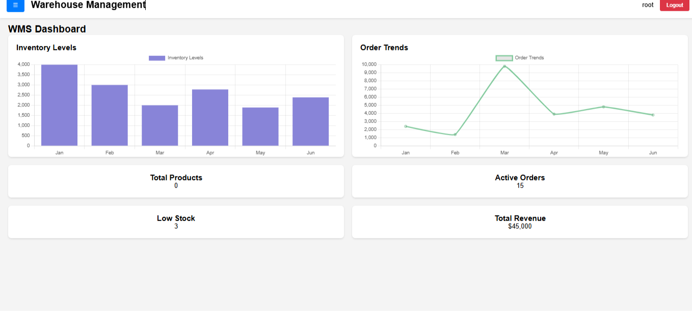

# 🏢 Warehouse Management System (WMS)

**Warehouse Management System (WMS)** is a full-stack web application designed to streamline and digitize inventory and warehouse operations. It offers a seamless user experience for managing inventory, user registration, and administrative tasks, all through a centralized dashboard.

> **Tech Stack:** HTML · CSS · JavaScript · PHP · MySQL · WAMP Stack

---

## 📦 Project Overview

The WMS platform provides tools for real-time tracking, storage optimization, and inventory control. From product registration to visual dashboards, WMS ensures efficient warehouse operations and smarter logistics.

---

## 🚀 Key Features

- 🧑‍💼 **User Registration & Login**  
  Secure and simple authentication using PHP and MySQL. Registered users gain access to personalized dashboards.

- 📊 **Interactive Dashboard**  
  Displays real-time statistics, visual graphs, and data summaries to help users monitor warehouse activities at a glance.

- 🗃️ **Inventory Management**  
  Add, edit, and delete multiple products with details such as item name, quantity, price, and total value calculation.

- 📂 **Vertical Sidebar Navigation**  
  Left-aligned menu with links to key sections:
  - WMS Dashboard
  - Inventory Management
  - About Us
  - Contact Us  
  Menu content is displayed vertically with clear spacing and modern styling.

- 🎨 **Responsive UI**  
  Professional and user-friendly design that adapts to different screen sizes.

- 🛠️ **Admin Control Panel**  
  Admin users can oversee all system operations, manage products, and monitor user activities.

---

## 🛠 Tech Stack

| Layer         | Technology      |
|---------------|------------------|
| **Frontend**  | HTML, CSS, JavaScript |
| **Backend**   | PHP |
| **Database**  | MySQL |
| **Platform**  | WAMP (Windows, Apache, MySQL, PHP) |

---

<h2>📷 Screenshots</h2>

<h3>Registration Page</h3>

<h3>Dashboard</h3>

<h3>Inventory Management</h3>

